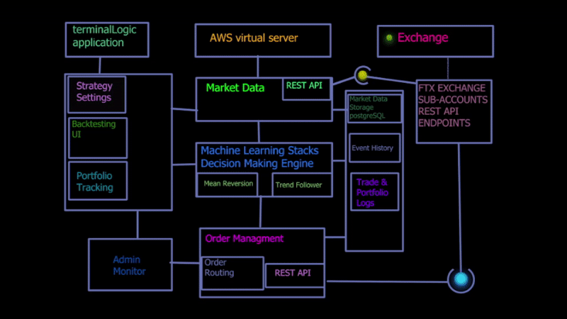

# terminalLogic

<!-- README -->
  <h3 align="center">terminalLogic</h3>
  
 
  Long your longs!!!!!
     
    <a href="https://github.com/travbz/terminallogic/issues">Report Bug</a>
    ·
    <a href="https://github.com/travbz/terminallogic/issues">Request Feature</a>
  

<!-- TABLE OF CONTENTS -->

  
<h2 style="display: inline-block">Table of Contents</h2>

  <ol>
    <li>
      <a href="#about-the-project">About The Project</a>
    <li><a href="#built-with">Built With</a></li>
    <li><a href="#roadmap">Roadmap</a></li>
    <li><a href="#contributing">Contributing</a></li>
    <li><a href="#contact">Contact</a></li>
  </ol>

<!-- ABOUT THE PROJECT -->
## About The Project

Cloud based derivitives trading engine, partially automated

*  Connects to FTX exchange via API using Python.  It extracts all market data from designated channels.
*  Using pandas and numpy, streaming websocket data is prepared/transformed from millisecond tick data to 1 minute OHLC(open, high, low, close)data, converted into a pd.DataFrame before its final migration to a SQLite database.
*  OHLC data is run through functions that add my trading strategies indicators to the DF.
*  Indicators are optimized with Random Forest Machine Learning and Grid Search
*  Unsupervised Learning market regime classification to detect market state
*  Signals are generated for long/short positions
*  backtesting of strategy performance and portfolio
*  Simple starter playground for algo trading

<!-- BUILT WITH -->
## Built With

* Jupyter Notebook
* SQLite3
* JavaScript
* Python
* HTML
* CSS
* jquery
* AWS ec2, s3, aws budgets
* SKLearn, Numpy, Pandas, and many, many, python libraries.
* contributions from friends and freelancers

<!-- ROADMAP -->
## Roadmap

<!-- CONTRIBUTING -->
## Contributing

Contributions are what make the open source community such an amazing place to be learn, inspire, and create. Any contributions you make are **greatly appreciated**.

1. Fork the Project
2. Create your Feature Branch (`git checkout -b feature/amazing_feature`)
3. Commit your Changes (`git commit -m 'Add some amazing_feature'`)
4. Push to the Branch (`git push origin feature/amazing_feature`)
5. Open a Pull Request

<!-- CONTACT -->
## Contact

* [Travis](https://github.com/Travbz/)
